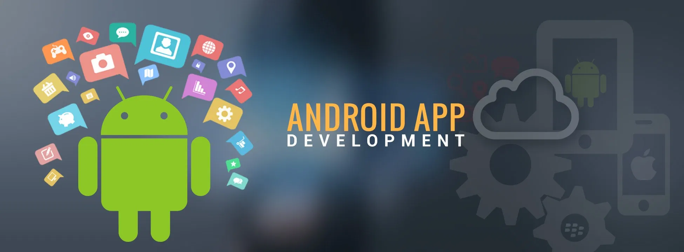

# Curso de Desenvolvimento de Aplicativos Android

## Como está estruturado? Quais os tópicos que vou aprender?

O curso começa com Introdução à computação e introdução à lógica de programação para pessoas que não possuam experiência em programação. Posteriormente é feita a instalação do Java e da IDE IntelliJ (ambiente de desenvolvimento) nos três sistemas operacionais mais usados atualmente, Windows, Linux e Mac.

Uma vez instalado os softwares, você tem o que precisa para aprender sobre Java que será a linguagem usada no desenvolvimento das aplicações. Os assuntos tratados englobam variaveis, tipos de dados, operações matemáticas, tipos primitivos e funções.

Posteriormente é feita a instalação do Android Studio e começamos com a prática de desenvolvimento de aplicações. As aplicações Android serão criadas do zero sem cópia de código para que seja possível entender toda a teoria para o desenvolvimento. Será feito a manipulação dos elementos de interface, customização e criação da lógica das aplicações.

Alguns dos assuntos cobertos: 

- Variáveis e tipos de dados, funções e exceções em Java;
- Estrutura de uma aplicação Android;
- Activity e ciclo de vida;
- LinearLayout;
- Alteração do ícone da aplicação;
- SharedPreferences e navegação entre Activies.

Para as aplicações, usaremos _Android Studio_ e versões mais recentes do Android!

## Quais os próximos passos?

Assista a aula introdutória e outras aulas que estão abertas de maneira a comprovar a qualidade didática que será usada durante o curso.

Além disso, *o curso é gratuito*, então por que não se inscrever e ver o que podemos fazer usando Android?

### O que você aprenderá

    - Conceitos teóricos e práticos sobre Android;
    - Como utilizar o software Android Studio para criar aplicações Android do zero;
    - Ter conhecimento da plataforma Android e como implementar simples funcionalidades;
    - Começar seu portfólio para entrevistas de emprego ou pelo simples fato de aprender;
    - Aprender os conceitos iniciais da linguagem Java.

Há algum requisito ou pré-requisito para o curso?

    - Um computador (Windows, Mac, Linux) com conexão à internet para fazer a instalação dos softwares necessários (vídeos específicos de instalação estão disponíveis para cada plataforma)
    Vontade de aprender e entusiasmos para construir softwares usando funcionalidades incríveis!

Para quem é este curso:

    - Para aqueles buscando tecnologia e conhecimento de como construir suas aplicações pessoais ou profissionais.

